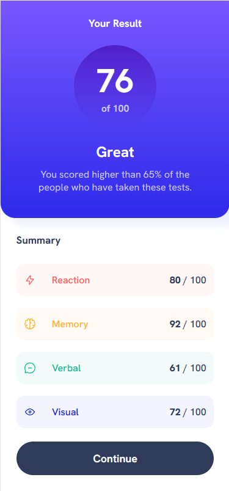

# Frontend Mentor - Results summary component solution

This is a solution to the [Results summary component challenge on Frontend Mentor](https://www.frontendmentor.io/challenges/results-summary-component-CE_K6s0maV). Frontend Mentor challenges help you improve your coding skills by building realistic projects. 

## Table of contents

- [Overview](#overview)
  - [The challenge](#the-challenge)
  - [Screenshot](#screenshot)
  - [Links](#links)
- [My process](#my-process)
  - [Built with](#built-with)
  - [What I learned](#what-i-learned)
  - [Continued development](#continued-development)
- [Author](#author)

## Overview

### The challenge

Users should be able to:

- View the optimal layout for the interface depending on their device's screen size
- See hover and focus states for all interactive elements on the page

### Screenshot

### Links

- Solution URL: [Add solution URL here](https://your-solution-url.com)
- Live Site URL: [Add live site URL here](https://your-live-site-url.com)

## My process
- Write boilerplate css
- Set up elements in html with descriptive classes.
- Develop mobile first
- Set up the flexboxes to get the right elements grouped together in the right orientations
- Once elements are set up the media query to change the flexboxes appropriately
- Now style all the elements to make look like the design and wireframes for mobile
- Style elements for desktop

### Built with

- Semantic HTML5 markup
- CSS custom properties
- Lots of flexbox'es
- Mobile-first workflow
- Comments for readability
- Using rem units for font-size, padding, margin and border radius.
- Using ch and % for width units
- Linear gradients
- Hover pseudo-class and cursor change
- Box-shadow css property

### What I learned

Learned to use linear gradients and the hsla color.
Learned about the box-shadow css property

### Continued development

- Continue using appropriate units for css properties.
- Continue using mobile first workflow but also ensuring that the desktop site is easily converted to just after setting the elements orientation and flexboxes.
- Always continue using comments for readability.

## Author

- Frontend Mentor - [@MoggStephen](https://www.frontendmentor.io/profile/MoggStephen)
- Linkedin - (https://www.linkedin.com/in/stephen-mogg-9467041bb/)